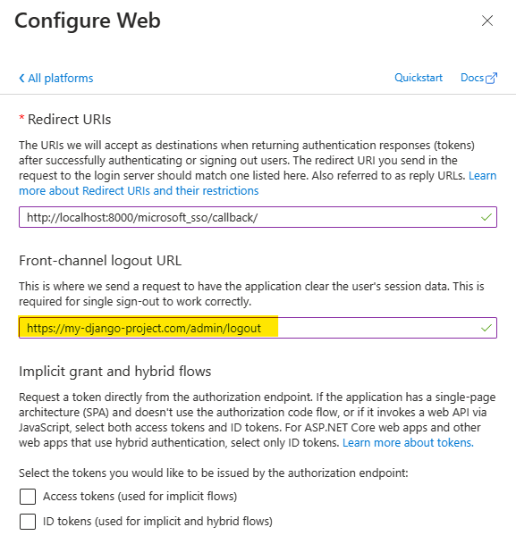

# Get your Callback URI

The callback URL is the URL where your Microsoft Entra Registered Application will redirect the user after the
authentication process. This URL must be registered in your Registered Application.

---

## The Callback URI
The callback URI is composed of `{scheme}://{netloc}/{path}/`, where the _netloc_ is the domain name of your Django
project, and the _path_ is `/microsoft_sso/callback/`. For example, if your Django project is hosted on
`https://myproject.com`, then the callback URL will be `https://myproject.com/microsoft_sso/callback/`.

So, let's break each part of this URI:

### The scheme
The scheme is the protocol used to access the URL. It can be `http` or `https`. **Django-Microsoft-SSO** will select the
same scheme used by the URL which shows to you the login page.

For example, if you're running locally, like `http://localhost:8000/accounts/login`, then the callback URL scheme
will be `http://`.

??? question "How about a Reverse-Proxy?"
    If you're running Django behind a reverse-proxy, please make sure you're passing the correct
    `X-Forwarded-Proto` header to the login request URL.

### The NetLoc
The NetLoc is the domain of your Django project. It can be a dns name, or an IP address, including the Port, if
needed. Some examples are: `example.com`, `localhost:8000`, `api.my-domain.com`, and so on. To find the correct netloc,
**Django-Microsoft-SSO** will check, in that order:

- If settings contain the variable `MICROSOFT_SSO_CALLBACK_DOMAIN`, it will use this value.
- If Sites Framework is active, it will use the domain field for the current site.
- The netloc found in the URL which shows you the login page.

### The Path
The path is the path to the callback view. It will be always `/<path in urls.py>/callback/`.

Remember when you add this to the `urls.py`?

```python
from django.urls import include, path

urlpatterns = [
    # other urlpatterns...
    path(
        "microsoft_sso/", include(
            "django_microsoft_sso.urls",
            namespace="django_microsoft_sso"
        )
    ),
]
```

The path starts with the `microsoft_sso/` part. If you change this to `sso/` for example, your callback URL will change to
`https://myproject.com/sso/callback/`.

---

## Registering the URI

Navigate to the [_**App registrations**_](https://portal.azure.com/#blade/Microsoft_AAD_RegisteredApps/ApplicationsListBlade)
page, select your Registered Application and navigate to _**Authentication**_.

On **Platform configurations**, if you don't have any platform configured, click on **Add a platform** and select **Web**.


To register the callback URL, add the callback URL in the
_**Redirect URIs**_ field, clicking on button `Add URI`. Then add your full URL and click on `Configure`.


!!! tip "Do not forget the trailing slash"
    Many errors on this step are caused by forgetting the trailing slash:

    * Good: `http://localhost:8000/microsoft_sso/callback/`
    * Bad: `http://localhost:8000/microsoft_sso/callback`

### Single Logout (from Microsoft)

To configure SLO (Single Logout), starting from Microsoft (logout from Microsoft first then logout from your Project) -
you can optionally add Django logout URL in the Web Platform configurations. But you must inform a **https** address:



!!! tip "During development, use an instant ingress tunnel service for this"
    [Ngrok](https://ngrok.com/) is an excellent service to redirect a https connection to your local development server.

---

In the next step, we will configure **Django-Microsoft-SSO** to auto create the Users.
