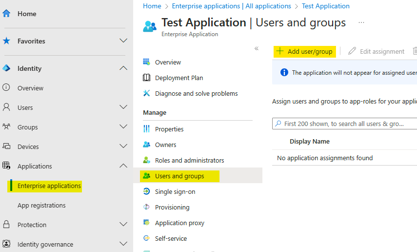

# Adding Microsoft Credentials

To make the SSO work, we need to set up, in your Django project, you need the credentials from your Microsoft Entra
_Registered Application_.

---

Microsoft is a huge company that works for even larger ones. This means that the Microsoft Entra Platform is
very complex and can be a bit confusing for newcomers. The following sections provide a brief overview of the
Microsoft Entra Platform and the key concepts that are relevant to the authentication process. You do not need
to understand all the details, but it is important to have a general idea of how the different components fit,
especially when you need to configure and troubleshoot your application.

## Understand Microsoft Tenants

Microsoft Entra, formerly known as Azure Active Directory (Azure AD), organizes user access and resources through a
unique entity known as a Tenant. A tenant represents a dedicated instance of Microsoft Entra ID, essentially serving as
a directory of users and groups that is owned and managed by an organization. Each tenant is distinct and separate from
other tenants, ensuring data privacy and security across the Microsoft Cloud environment.

!!! tip "What the Tenant means to your Organization?"
    The tenant can be your entire company, a business unit or even a single
    department. It is a security boundary that defines the scope of administrative authority for an organization.

    The most important thing to understand here is while you can restrict or permit data to be shared between entities
    _inside_ a tenant, you are not allowed to share data _between_ them.

## Understand the Registered Enterprise Application

To your projects can interact with your Tenants, you will need to register an Enterprise Application:

### Registered Application
Registering an application in Microsoft Entra informs the platform about the application's existence and defines the
interaction parameters between the platform and the projects which will access it through the application. The
registration encompasses details like the application's name, type (e.g., web, public, native), redirect URIs, client
identifiers, client secrets, and other settings controlling the interaction with the identity service.

### Enterprise Application
Once registered, the application can be utilized across one or more Microsoft Entra tenants. A registered
application is referred to an "Enterprise Application" for the purpose of the configurations the application needs
regard a tenant, covering aspects like who can use the application, the permissions it holds,
monitoring, auditing, and more.

### Single or Multi-tenant Applications
The distinction between single-tenant and multi-tenant configurations is important for understanding how applications
interact with user identities and resources within the Microsoft Entra ecosystem. In a single-tenant configuration,
the application is registered within a specific tenant, ensuring that only users from that particular tenant can
authenticate. On the other hand, a multi-tenant configuration allows an application to be available to users across
multiple tenants. This setup facilitates broader access and interoperability, catering to scenarios where an
application needs to be accessible to users from different organizational domains.

!!! tip "What the Registered Enterprise Application means to your Organization?"
    This can be a single application to handle all users, from all tenants to all projects you want to authenticate.
    Or can be a complex multiple applications for multi-tenant and multiple projects/environments.
    The final organization depends on your company compliance needs.

    The most important thing here is while you can _start_ with just One-App-to-Rule-All, you will eventually finish with a
    configuration which embraces your company needs. Do not underestimate this task.

!!! info "To learn more:"
    * [Multi-tenant user management introduction](https://learn.microsoft.com/en-us/azure/active-directory/architecture/multi-tenant-user-management-introduction)
    * [Single and Multi Tenants Apps](https://learn.microsoft.com/en-us/azure/active-directory/develop/single-and-multi-tenant-apps)
    * [OAuth 2.0 and OpenID Connect (OIDC) in the Microsoft identity platform](https://learn.microsoft.com/en-us/azure/active-directory/develop/v2-protocols)


## Creating your first Microsoft Entra Registered Application

To create your first Microsoft Entra Registered Application, you need to access the
[Microsoft Entra Administration Center](https://entra.microsoft.com/?l=en.en-us#home) and navigate to [_Applications ->
App registrations_](https://entra.microsoft.com/?l=en.en-us#view/Microsoft_AAD_RegisteredApps/ApplicationsListBlade/quickStartType~/null/sourceType/Microsoft_AAD_IAM).

For the purpose of this tutorial, we suggest creating a new registered application, clicking on the _**New registration**_ button.

??? question "Do I use an existing application or create a new one?"
    The decision to use an existing Application or create a new one depends on your needs: you can create an application
    for each project you have, for each group of users, or for each environment (development, staging, production, etc...).

    The safest route is to create a new single-tenant application for _each project_ for _each environment_. This helps to mitigate
    the risk of exposing all your data in case of a security breach and the risk of service interruption due to
    misconfiguration. But in the other hand, this can be a bit cumbersome and fairly complex to manage.

    In the end, any solution must be compatible with how your organization works.

Navigate to the [_**App registrations**_](https://portal.azure.com/#blade/Microsoft_AAD_RegisteredApps/ApplicationsListBlade) page and click on the _**New registration**_ button.


Add a new name for the app, and select the _**Supported account types**_ to _**Accounts in this organizational directory only**_.


Go back to the **_Overview_** tab and retrieve the **Application (client) ID**. This will be the `MICROSOFT_SSO_APPLICATION_ID` in your Django project.


Now, navigate to the **_Certificates & secrets_** tab and click on the **_New client secret_** button. Add a description for the secret and select the expiration date. Click on the **_Add_** button.


In the next page, copy the **Value** of the secret. This will be the `MICROSOFT_SSO_CLIENT_SECRET` in your Django project.


Navigate to Enterprise applications, select your application and go  to the _**Users and Groups**_ tab and add a test user to your application.



## Configuring your Django Project

After that, add the credentials in your `settings.py` file:

```python
# settings.py
MICROSOFT_SSO_APPLICATION_ID = "your Application (client) Id here"
MICROSOFT_SSO_CLIENT_SECRET = "your client secret value here"
```

Don't commit this info in your repository.
This permits you to have different credentials for each environment and mitigates security breaches.
That's why we recommend you to use environment variables to store this info.
To read this data, we recommend you to install and use a [Twelve-factor compatible](https://www.12factor.net/) library
in your project.

For example, you can use our project [Stela](https://github.com/megalus/stela) to load the environment
variables from a `.env.local` file, like this:

```ini
# .env.local
MICROSOFT_SSO_APPLICATION_ID = "your Application (client) Id here"
MICROSOFT_SSO_CLIENT_SECRET = "your client secret value here"
```

```python
# Django settings.py
from stela import env

MICROSOFT_SSO_APPLICATION_ID = env.MICROSOFT_SSO_APPLICATION_ID
MICROSOFT_SSO_CLIENT_SECRET = env.MICROSOFT_SSO_CLIENT_SECRET
```

But in fact, you can use any library you want, like
[django-environ](https://pypi.org/project/django-environ/), [django-constance](https://github.com/jazzband/django-constance),
[python-dotenv](https://pypi.org/project/python-dotenv/), etc...

---

In the next step, we need to configure the authorized callback URI for your Django project.
